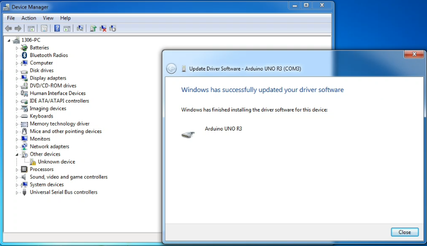

Arduino电子爱好者通用元件包套件503C

# 1、说明

这个套件包含我们玩单片机时使用到的最基本的元件，如按键、LED、电位器等。它适用于各种单片机和树莓派。我们还会根据这些元件，提供一些基于Arduino开发板的一些学习课程，如LED闪烁实验、LCD显示实验等，让你对这些电子元件和Arduino开发板有个初步的了解。

# 2、清单

|编码|名称|描述|数量|图片|
|-|-|-|-|-|
|1|LED|F5-红发红-短|5||
|2|LED|F5-黄发黄-短|5||
|3|LED|F5-蓝发蓝-短|5||
|4|电阻|碳膜色环 1/4W 1% 100R 编带|30|×30|
|5|电阻|碳膜色环 1/4W 5% 1K 编带|30|×30|
|6|电阻|碳膜色环 1/4W 5% 4.7K 编带|30|×30|
|7|电阻|碳膜色环 1/4W 5% 10K 编带|30|×30|
|8|电阻|碳膜色环 1/4W 5% 100K 编带|30|×30|
|9|电阻|碳膜色环 1/4W 1% 47K 编带|30|×30|
|10|电阻|碳膜色环 1/4W 5% 1M 编带|30|×30|
|11|可调电位器|3386MU 103（三针直排）|2||
|12|按键帽|A24 红帽(12*12*7.3)圆|2||
|13|按键帽|A24 蓝帽(12*12*7.3)圆|2||
|14|轻触按键|12*12*7.3MM 插件|4||
|15|蜂鸣器|有源 12*9.5MM 5V 普通分体 2300Hz|1||
|16|蜂鸣器|无源 12*8.5MM 5V 普通分体 2K|1||
|17|LCD|1602 COB 5V 蓝屏（一个电阻）|1||
|18|排针|1*40直针 黑色 2.54|1||
|19|面包板|ZY-60 400孔白色（纸卡包装）|1||
|20|面包线|面包板连接线30根|1||
|21|元件盒|绿色 2# 绿 75×31.5×21.5 16克|1||

# 3、Arduino IDE和驱动的安装

当我们拿到开发板时，首先我们要安装Arduino IDE和驱动，相关文件我们可以在官网上找到，以下链接是包含各种系统、各种版本的Arduino IDE和驱动任你选择。

<https://www.arduino.cc/en/Main/OldSoftwareReleases#1.5.x>

下面我们介绍下Arduino-1.5.6 版本IDE在Windows系统的安装方法。

下载下来的文件是一个arduino-1.5.6-r2-windows.zip的压缩文件夹，解压出来到硬盘。

双击Arduino-1.5.6 .exe文件

然后

然后

等待安装完成.点击close，安装完成。

1.5.6版本安装后的样子。

接下来是开发板驱动的安装，这次我们安装的是Keyes UNO R3
开发板的驱动，Keyes 2560 R3
开发板安装驱动方法和这个类似，驱动文件可以用同一个文件。

不同的系统，安装驱动的方法也有一些细小的区别，下面我们介绍在WIN 7系统安装驱动的方法。

第一次Keyes UNO R3
开发板连接电脑时，点击计算机--属性--设备管理器，显示如下图。

点击 Unknown device 安装驱动，如下图。

进入下图，选择

找到Arduino安装位置的drivers文件夹

点击“Next”，今天下图选择，开始安装驱动

安装驱动完成，出现下图点击Close。

这样驱动就装好了。点击计算机--属性--设备管理器，我们可看见如下图。

# 4、Arduino IDE的使用方法

Keyes UNO R3
开发板的USB驱动安装成功之后，我们可以在Windows设备管理器中找到相应的串口。

下面示范第一个程序的烧写，串口监视器中显示“Hello World！”。

测试代码为：

int val;

int ledpin=13;

void setup()

{

Serial.begin(9600);

pinMode(ledpin,OUTPUT);

}

void loop()

{

val=Serial.read();

if(val=='R')

{

digitalWrite(ledpin,HIGH);

delay(500);

digitalWrite(ledpin,LOW);

delay(500);

Serial.println("Hello World!");

}

}

我们打开Arduino 的软件，编写一段程序让Keyes UNO R3
开发板接受到我们发的指令就显示“Hello World！”字符串；我们再借用一下Keyes UNO R3 开发板上的 D13
的指示灯，让Keyes UNO R3
开发板接受到指令时指示灯闪烁一下，再显示“Hello World！”。

打开Arduino 的软件，设置板，如下。

设置COM端口，如下

点击编译程序，检查程序是否错误；点击上传程序；Keyes UNO R3 开发板设置OK后右下脚显示如下图，和设备管理器中显示一致。

上传成功，输入R，点击发送，Keyes UNO R3 开发板上的 D13
的指示灯闪烁一次，串口监视器中显示 Hello World! 如下图

那么恭喜你，你的第一个程序已经成功了！！！

# 5、实验课程

## 实验一 LED 闪烁实验

实验说明

LED 闪烁实验是比较基础的实验之一，上一个“ Hello World！”实验里已经利用到了Arduino 自带的LED，这次我们利用其他I/O
口和外接直插LED 灯来完成这个实验。

实验器材

开发板\*1

USB线\*1

LED\*1

100Ω 电阻\*1

面包板\*1

面包板连接线若干

接线图

测试代码

int led = 2; //定义数字口2

void setup()

{

  pinMode(led, OUTPUT);     //设置led为输出

}

void loop()

{

  digitalWrite(led, HIGH);   //开启led

  delay(1000); //延迟1秒

  digitalWrite(led, LOW);    //关闭led

  delay(1000);//延迟1秒

}

测试结果

下载完程序就可以看到我们的IO口外接小灯在闪烁了，这样我们的实验现象为LED不停闪烁，间隔大约为1秒。

## 实验二 呼吸灯实验

实验说明

上一课程中我们只是控制LED的亮和灭，那么我们可以怎么控制LED的亮度呢？本课程中我们把LED接到PWM口中，然后通过改变PWM数值，调节LED亮度，使LED逐渐变亮，和逐渐变暗，从而达到呼吸灯的效果。

实验器材

开发板\*1

USB线\*1

LED\*1

100Ω 电阻\*1

面包板\*1

面包板连接线若干

接线图

测试代码

int ledPin = 3; // 定义数字口3

void setup()

{

pinMode(ledPin, OUTPUT);// 将ledPin设置为输出

}

void loop()

{

for (int a=0; a\<=255;a++)// 设置使LED逐渐变亮

{

analogWrite(ledPin,a); //
开启led,调节亮度，范围是0-255，在255时led最亮

delay(10); // 延迟0.01S

}

for (int a=255; a\>=0;a--) // 设置使LED逐渐变暗

{

analogWrite(ledPin,a); //
开启led,调节亮度，范围是0-255，在255时led最亮

delay(10); // 延迟0.01秒

}

delay(1000);// 延迟1秒

}

测试结果

下载完程序就可以看到我们的IO口外接小灯显示出呼吸灯的效果，小灯先逐渐变亮，后逐渐变暗，循环交替。

## 实验三 广告灯实验

实验说明

在生活中我们经常会看到一些由各种颜色的led灯组成的广告牌，广告牌上各个位置上癿led灯不断的变话,形成各种效果。本节实验就是利用led灯编程模拟广告灯效果。

实验器材

开发板\*1

USB线\*1

LED\*5

100Ω 电阻\*5

面包板\*1

面包板连接线若干

接线图

测试代码

int BASE = 2 ; //第一个 LED 接的 I/O 口

int NUM = 5; //LED 的总数

void setup()

{

for (int i = BASE; i \< BASE + NUM; i ++)

{

pinMode(i, OUTPUT); //设定数字I/O口为输出

}

}

void loop()

{

for (int i = BASE; i \< BASE + NUM; i ++)

{

digitalWrite(i, HIGH); //设定数字I/O口输出为"高"，即逐渐开灯

delay(200); //延迟

}

for (int i = BASE; i \< BASE + NUM; i ++)

{

digitalWrite(i, LOW); //设定数字I/O口输出为"低"，即逐渐关灯

delay(200); //延迟

}

}

测试结果

下载完程序就可以看到我们的IO口外接小灯先逐渐变亮，然后逐渐变暗，循环交替。

## 实验四 按键控制LED实验

实验说明

I/O 口的意思即为INPUT 接口和OUTPUT
接口，到目前为止我们设计的小灯实验都还只是应用到Arduino 的I/O
口的输出功能，这个实验我们来尝试一下使用Arduino的I/O
口的输入功能即为读取外接设备的输出值，我们用一个按键和一个LED
小灯完成一个输入输出结合使用的实验，让大家能简单了解I/O 的作用。

实验器材

开发板 \*1

USB线\*1

LED\*1

轻触按键\*1

100Ω 电阻\*1

10KΩ 电阻\*1

面包板\*1

面包板连接线若干

接线图

测试代码

int ledPin = 11; //定义数字口11

int inputPin = 3; //定义数字口3

void setup()

{

pinMode(ledPin, OUTPUT); //将ledPin设置为输出

pinMode(inputPin, INPUT); //将inputPin设置为输入

}

void loop()

{

int val = digitalRead(inputPin);

//设置数字变量val，读取到数字口3的数值，并赋值给 val

if (val == LOW) //当val为低电平时，LED变暗

{

digitalWrite(ledPin, LOW); // LED变暗

}

else

{

digitalWrite(ledPin, HIGH); // LED亮起

}

}

测试结果

下载完程序，上电后，当按键按下时小灯亮起，否则小灯不亮。

## 实验五 抢答器实验

实验说明

完成上面的实验以后相信已经有很多朋友可以独立完成这个实验了，我们可以将上面的按键控制小灯的实验扩展成4个按键对应3
个小灯，占用7个数字I/O
接口。本实验中我们利用4个按键控制3个LED灯，从而达到抢答器的效果。

实验器材

开发板\*1

USB线\*1

RGB灯\*1

轻触按键\*4

10KΩ 电阻\*4

100Ω 电阻\*3

面包板\*1

面包板连接线若干

杜邦线若干

接线图

测试代码

int redled=9;

int yellowled=10;

int blueled=11;

int redpin=5;

int yellowpin=4;

int bluepin=3;

int restpin=2;

int red;

int yellow;

int blue;

void setup()

{

pinMode(redled,OUTPUT);

pinMode(yellowled,OUTPUT);

pinMode( blueled,OUTPUT);

pinMode(redpin,INPUT);

pinMode(yellowpin,INPUT);

pinMode(bluepin,INPUT);

}

void loop()

{

red=digitalRead(redpin);

yellow=digitalRead(yellowpin);

blue=digitalRead(bluepin);

if(red==LOW)RED_YES();

if(yellow==LOW)YELLOW_YES();

if(blue==LOW)BLUE_YES();

}

void RED_YES()

{

while(digitalRead(restpin)==1)

{

digitalWrite(redled, HIGH);

digitalWrite(yellowled, LOW);

digitalWrite(blueled, LOW);

}

clear_led();

}

void YELLOW_YES()

{

while(digitalRead(restpin)==1)

{

digitalWrite(redled, LOW);

digitalWrite(yellowled, HIGH);

digitalWrite(blueled, LOW);

}

clear_led();

}

void BLUE_YES()

{

while(digitalRead(restpin)==1)

{

digitalWrite(redled, LOW);

digitalWrite(yellowled, LOW);

digitalWrite(blueled, HIGH);

}

clear_led();

}

void clear_led()

{

digitalWrite(redled, LOW);

digitalWrite(yellowled, LOW);

digitalWrite(blueled, LOW);

}

测试结果

按照接线图接线，上传完程序，上电后，一个简单的抢答器就做好了，我们根据亮起不同的LED灯，判断谁抢答成功。在复位后，三个LED灯关闭。

## 实验六 电位器调控灯光亮度实验

实验说明

在第二课程中我们直接通过PWM口控制灯的亮度，从而达到呼吸灯的效果。在这课程中我们通过一个电位器，利用电位器调节PWM值，从而控制灯的亮度。

实验器材

开发板\*1

USB线\*1

LED\*1

100Ω 电阻\*1

可调电位器\*1

面包板\*1

面包板连接线若干

接线图

测试代码

int ledpin=11;//定义数字接口11（PWM 输出）

void setup()

{

pinMode(ledpin,OUTPUT);//定义数字接口11 为输出

Serial.begin(9600);//设置波特率为9600

}

void loop()

{

int val=analogRead(0);//读取模拟口A0口的值

val = map(val, 0, 1023, 0, 255);//从0-1023映射到0-255

Serial.println(val);//显示val 变量

analogWrite(ledpin,val);// 打开LED 并设置亮度

delay(100);//延时0.1 秒

}

测试结果

下载完程序后。我们可以通过旋转可调电位器控制小灯的亮度，打开串口监视器，设置波特率为9600，就可看到调节LED亮度的PWM值。

## 实验七 有源蜂鸣器实验

实验说明

蜂鸣器可分为有源蜂鸣器和无源蜂鸣器两种。本课程中主要用到了有源蜂鸣器，有源蜂鸣器内部有一简单的振荡电路，能将恒定的直流电转化成一定频率的脉冲信号。实验中中我们只需要给蜂鸣器输入一个高电平信号，蜂鸣器响起。

实验器材

开发板\*1

USB线\*1

有源蜂鸣器\*1

面包板\*1

面包板连接线若干

接线图

测试代码

int buzzer = 2; //定义数字口2

void setup()

{

  pinMode(buzzer, OUTPUT);     //设置buzzer为输出

}

void loop()

{

  digitalWrite(buzzer, HIGH);   //开启buzzer

  delay(1000); //延迟1S

  digitalWrite(buzzer, LOW);    //关闭buzzer

  delay(1000);//延迟1S

}

测试结果

下载完程序后，我们可以听到蜂鸣器响1秒，停止响起1秒，循环交替。

## 实验八 无源蜂鸣器实验

实验说明

蜂鸣器可分为有源蜂鸣器和无源蜂鸣器两种。本课程中主要用到了无源蜂鸣器，无源蜂鸣器内部不带振荡源，直流信号无法令其鸣叫，须用方波驱动。

实验器材

开发板 \*1

USB线\*1

无源蜂鸣器\*1

面包板\*1

正标线若干

接线图

测试代码

code 1:

int buzzer=3; //定义数字口3

void setup()

{

pinMode(buzzer,OUTPUT);//将buzzer设置为输出

}

void loop()

{

unsigned char i,j;//定义变量i，j

while(1)

{

for(i=0;i\<80;i++)// 输出一个频率的声音

{

digitalWrite(buzzer,HIGH);

delay(1);//延迟1ms

digitalWrite(buzzer,LOW);

delay(1);//延迟1ms

}

for(i=0;i\<100;i++)// 输出另一个频率的声音

{

digitalWrite(buzzer,HIGH);

delay(2);//延迟2ms

digitalWrite(buzzer,LOW);

delay(2);//延迟2ms

}

}

}

code 2:

\#define D0 -1

\#define D1 262

\#define D2 293

\#define D3 329

\#define D4 349

\#define D5 392

\#define D6 440

\#define D7 494

\#define M1 523

\#define M2 586

\#define M3 658

\#define M4 697

\#define M5 783

\#define M6 879

\#define M7 987

\#define H1 1045

\#define H2 1171

\#define H3 1316

\#define H4 1393

\#define H5 1563

\#define H6 1755

\#define H7 1971

//列出全部D调的频率

\#define WHOLE 1

\#define HALF 0.5

\#define QUARTER 0.25

\#define EIGHTH 0.25

\#define SIXTEENTH 0.625

//列出所有节拍

int tune\[\]= //根据简谱列出各频率

{

M3,M3,M4,M5,

M5,M4,M3,M2,

M1,M1,M2,M3,

M3,M2,M2,

M3,M3,M4,M5,

M5,M4,M3,M2,

M1,M1,M2,M3,

M2,M1,M1,

M2,M2,M3,M1,

M2,M3,M4,M3,M1,

M2,M3,M4,M3,M2,

M1,M2,D5,D0,

M3,M3,M4,M5,

M5,M4,M3,M4,M2,

M1,M1,M2,M3,

M2,M1,M1

};

float durt\[\]= //根据简谱列出各节拍

{

1,1,1,1,

1,1,1,1,

1,1,1,1,

1+0.5,0.5,1+1,

1,1,1,1,

1,1,1,1,

1,1,1,1,

1+0.5,0.5,1+1,

1,1,1,1,

1,0.5,0.5,1,1,

1,0.5,0.5,1,1,

1,1,1,1,

1,1,1,1,

1,1,1,0.5,0.5,

1,1,1,1,

1+0.5,0.5,1+1,

};

int length;

int tonepin=3; //得用3号接口

void setup()

{

pinMode(tonepin,OUTPUT);

length=sizeof(tune)/sizeof(tune\[0\]); //计算长度

}

void loop()

{

for(int x=0;x\<length;x++)

{

tone(tonepin,tune\[x\]);

delay(500\*durt\[x\]);
//这里用来根据节拍调节延时，500这个指数可以自己调整，在该音乐中，我发现用500比较合适。

noTone(tonepin);

}

delay(2000);

}

测试结果

实验中我们提供了两个例程，上传例程1代码后，蜂鸣器会发出两种不同的声音，实验中，两种声音循环交替。上传例程2中代码后，蜂鸣器会想响起《欢乐颂》的曲子。

## 实验九 1602液晶显示实验

实验说明

本次试验使用keyes UNO R3
直接驱动1602液晶显示文字。1602液晶在应用中非常广泛，它的显示容量为16×2个字符，芯片工作电压为4.5～5.5V。1602液晶在接keyes UNO R3
控制板显示文字时有两种接线法，分别为4位接法和8位接法，本实验中都会有相关说明介绍。

实验器材

开发板\*1

USB线\*1

1602 LCD\*1

可调电位器\*1

面包板\*1

面包板连接线若干

接线图

四位接法

八位接法

测试代码

四位接法

/\*

LiquidCrystal Library - Hello World

Demonstrates the use a 16x2 LCD display. The LiquidCrystal

library works with all LCD displays that are compatible with the

Hitachi HD44780 driver. There are many of them out there, and you

can usually tell them by the 16-pin interface.

This sketch prints "Hello World!" to the LCD

and shows the time.

The circuit:

\* LCD RS pin to digital pin 2

\* LCD Enable pin to digital pin3

\* LCD D4 pin to digital pin 4

\* LCD D5 pin to digital pin 5

\* LCD D6 pin to digital pin 6

\* LCD D7 pin to digital pin 7

\* LCD R/W pin to ground

\* LCD VSS pin to ground

\* LCD VCC pin to 5V

\* 10K resistor:

\* ends to +5V and ground

\* wiper to LCD VO pin

\*/

// include the library code:

\#include \<LiquidCrystal.h\>

// initialize the library with the numbers of the interface pins

LiquidCrystal lcd(2, 3, 4, 5, 6, 7);

void setup() {

// set up the LCD's number of columns and rows:

lcd.begin(16, 2);

// Print a message to the LCD.

lcd.setCursor(2,0);

lcd.print("Hello, world!");

lcd.setCursor(2,1);

lcd.print("Hello, keyes!");

}

void loop() {

}

注意：在上传程序前，要把LiquidCrystal文件夹放到 编译器安装目录下的

\Arduino\libraries里。不然编译不过。

例如我的：C:\Program Files\Arduino\libraries

八位接法

int DI = 12;

int RW = 11;

int DB\[\] = {3, 4,5, 6,7 ,8, 9, 10};//使用数组来定义总线需要的管脚

int Enable = 2;

void LcdCommandWrite(int value) {

// 定义所有引脚

int i = 0;

for (i=DB\[0\]; i \<= DI; i++) //总线赋值

{

digitalWrite(i,value &
01);//因为1602液晶信号识别是D7-D0(不是D0-D7)，这里是用来反转信号。

value \>\>= 1;

}

digitalWrite(Enable,LOW);

delayMicroseconds(1);

digitalWrite(Enable,HIGH);

delayMicroseconds(1); // 延时1ms

digitalWrite(Enable,LOW);

delayMicroseconds(1); // 延时1ms

}

void LcdDataWrite(int value) {

// 定义所有引脚

int i = 0;

digitalWrite(DI, HIGH);

digitalWrite(RW, LOW);

for (i=DB\[0\]; i \<= DB\[7\]; i++) {

digitalWrite(i,value & 01);

value \>\>= 1;

}

digitalWrite(Enable,LOW);

delayMicroseconds(1);

digitalWrite(Enable,HIGH);

delayMicroseconds(1);

digitalWrite(Enable,LOW);

delayMicroseconds(1); // 延时1ms

}

void setup (void) {

int i = 0;

for (i=Enable; i \<= DI; i++) {

pinMode(i,OUTPUT);

}

delay(100);

// 短暂的停顿后初始化LCD

// 用于LCD控制需要

LcdCommandWrite(0x38); // 设置为8-bit接口，2行显示，5x7文字大小

delay(64);

LcdCommandWrite(0x38); // 设置为8-bit接口，2行显示，5x7文字大小

delay(50);

LcdCommandWrite(0x38); // 设置为8-bit接口，2行显示，5x7文字大小

delay(20);

LcdCommandWrite(0x06); // 输入方式设定

// 自动增量，没有显示移位

delay(20);

LcdCommandWrite(0x0E); // 显示设置

// 开启显示屏，光标显示，无闪烁

delay(20);

LcdCommandWrite(0x01); // 屏幕清空，光标位置归零

delay(100);

LcdCommandWrite(0x80); // 显示设置

// 开启显示屏，光标显示，无闪烁

delay(20);

}

void loop (void) {

LcdCommandWrite(0x01); // 屏幕清空，光标位置归零

delay(10);

LcdCommandWrite(0x80+2);

delay(10);

// 写入欢迎信息

LcdDataWrite('H');

LcdDataWrite('e');

LcdDataWrite('l');

LcdDataWrite('l');

LcdDataWrite('o');

LcdDataWrite(',');

LcdDataWrite(' ');

LcdDataWrite('w');

LcdDataWrite('o');

LcdDataWrite('r');

LcdDataWrite('l');

LcdDataWrite('d');

LcdDataWrite('!');

delay(10);

LcdCommandWrite(0xc0+2); // 定义光标位置为第二行第二个位置

delay(10);

LcdDataWrite('H');

LcdDataWrite('e');

LcdDataWrite('l');

LcdDataWrite('l');

LcdDataWrite('o');

LcdDataWrite(',');

LcdDataWrite(' ');

LcdDataWrite('k');

LcdDataWrite('e');

LcdDataWrite('y');

LcdDataWrite('e');

LcdDataWrite('s');

LcdDataWrite('!');

LcdDataWrite(' ');

delay(5000);

}

测试结果

无论是四位接法还是八位接法，接好线，烧录程序上电后，通过旋转电位器调节背光，即可在1602 LCD上看到设置的显示字符。四位接法和八位接法显示一样，第一行显示
"Hello, world!"字符，第二行显示"Hello, keyes!"字符。

# 6、相关资料链接

<https://pan.baidu.com/s/1On8wjRWip6cw0udCeQIWGA>

提取码：5qh1

