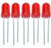
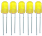
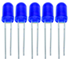
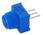
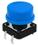
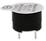
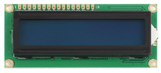
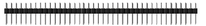
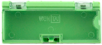

.. _2、清单:

2、清单
=======

.. container:: table-wrapper

   +------+------------+----------------------------------+------+----------------------+
   | 编码 | 名称       | 描述                             | 数量 | 图片                 |
   +======+============+==================================+======+======================+
   | 1    | LED        | F5-红发红-短                     | 5    | |image26|            |
   +------+------------+----------------------------------+------+----------------------+
   | 2    | LED        | F5-黄发黄-短                     | 5    | |image27|            |
   +------+------------+----------------------------------+------+----------------------+
   | 3    | LED        | F5-蓝发蓝-短                     | 5    | |image28|            |
   +------+------------+----------------------------------+------+----------------------+
   | 4    | 电阻       | 碳膜色环 1/4W 1% 100R 编带       | 30   | |image29|\ ×30       |
   +------+------------+----------------------------------+------+----------------------+
   | 5    | 电阻       | 碳膜色环 1/4W 5% 1K 编带         | 30   | |image30|\ ×30       |
   +------+------------+----------------------------------+------+----------------------+
   | 6    | 电阻       | 碳膜色环 1/4W 5% 4.7K 编带       | 30   | |image31|\ ×30       |
   +------+------------+----------------------------------+------+----------------------+
   | 7    | 电阻       | 碳膜色环 1/4W 5% 10K 编带        | 30   | |image32|\ ×30       |
   +------+------------+----------------------------------+------+----------------------+
   | 8    | 电阻       | 碳膜色环 1/4W 5% 100K 编带       | 30   | |image33|\ ×30       |
   +------+------------+----------------------------------+------+----------------------+
   | 9    | 电阻       | 碳膜色环 1/4W 1% 47K 编带        | 30   | |image34|\ ×30       |
   +------+------------+----------------------------------+------+----------------------+
   | 10   | 电阻       | 碳膜色环 1/4W 5% 1M 编带         | 30   | |image35|\ ×30       |
   +------+------------+----------------------------------+------+----------------------+
   | 11   | 可调电位器 | 3386MU 103 三针直排              | 2    | |image36|\ |image37| |
   +------+------------+----------------------------------+------+----------------------+
   | 12   | 按键帽     | A24 红帽 12\ *12*\ 7.3 圆        | 2    | |image38|\ |image39| |
   +------+------------+----------------------------------+------+----------------------+
   | 13   | 按键帽     | A24 蓝帽 12\ *12*\ 7.3 圆        | 2    | |image40|\ |image41| |
   +------+------------+----------------------------------+------+----------------------+
   | 14   | 轻触按键   | 12\ *12*\ 7.3MM 插件             | 4    | |image42|\ |image43| |
   +------+------------+----------------------------------+------+----------------------+
   | 15   | 蜂鸣器     | 有源 12*9.5MM 5V 普通分体 2300Hz | 1    | |image44|            |
   +------+------------+----------------------------------+------+----------------------+
   | 16   | 蜂鸣器     | 无源 12*8.5MM 5V 普通分体 2K     | 1    | |image45|            |
   +------+------------+----------------------------------+------+----------------------+
   | 17   | LCD        | 1602 COB 5V 蓝屏 一个电阻        | 1    | |image46|            |
   +------+------------+----------------------------------+------+----------------------+
   | 18   | 排针       | 1*40直针 黑色 2.54               | 1    | |image47|            |
   +------+------------+----------------------------------+------+----------------------+
   | 19   | 面包板     | ZY-60 400孔白色 纸卡包装         | 1    | |image48|            |
   +------+------------+----------------------------------+------+----------------------+
   | 20   | 面包线     | 面包板连接线30根                 | 1    | |image49|            |
   +------+------------+----------------------------------+------+----------------------+
   | 21   | 元件盒     | 绿色 2# 绿 75×31.5×21.5 16克     | 1    | |image50|            |
   +------+------------+----------------------------------+------+----------------------+

.. |image4| image:: media/f6a8649da4e79abb2f1d15479f073bb5.jpg
.. |image5| image:: media/f6a8649da4e79abb2f1d15479f073bb5.jpg
.. |image6| image:: media/f6a8649da4e79abb2f1d15479f073bb5.jpg
.. |image7| image:: media/f6a8649da4e79abb2f1d15479f073bb5.jpg
.. |image8| image:: media/f6a8649da4e79abb2f1d15479f073bb5.jpg
.. |image9| image:: media/f6a8649da4e79abb2f1d15479f073bb5.jpg
.. |image10| image:: media/f6a8649da4e79abb2f1d15479f073bb5.jpg

.. |image13| image:: media/f4522a2209f122d0b094cb5e4755b211.jpg
.. |image14| image:: media/f4522a2209f122d0b094cb5e4755b211.jpg

.. |image17| image:: media/f4522a2209f122d0b094cb5e4755b211.jpg

.. |image20| image:: media/0c80123578173c033dcc8f1b73b1a58b.jpg

.. |image23| image:: media/5b59c759d98d3d24894a09e0ac878717.png
.. |image24| image:: media/aa5f4d54d5b8ec553906f3890bc2df0c.png

.. |image29| image:: media/f6a8649da4e79abb2f1d15479f073bb5.jpg
.. |image30| image:: media/f6a8649da4e79abb2f1d15479f073bb5.jpg
.. |image31| image:: media/f6a8649da4e79abb2f1d15479f073bb5.jpg
.. |image32| image:: media/f6a8649da4e79abb2f1d15479f073bb5.jpg
.. |image33| image:: media/f6a8649da4e79abb2f1d15479f073bb5.jpg
.. |image34| image:: media/f6a8649da4e79abb2f1d15479f073bb5.jpg
.. |image35| image:: media/f6a8649da4e79abb2f1d15479f073bb5.jpg

.. |image38| image:: media/f4522a2209f122d0b094cb5e4755b211.jpg
.. |image39| image:: media/f4522a2209f122d0b094cb5e4755b211.jpg

.. |image42| image:: media/f4522a2209f122d0b094cb5e4755b211.jpg

.. |image45| image:: media/0c80123578173c033dcc8f1b73b1a58b.jpg

.. |image48| image:: media/5b59c759d98d3d24894a09e0ac878717.png
.. |image49| image:: media/aa5f4d54d5b8ec553906f3890bc2df0c.png

